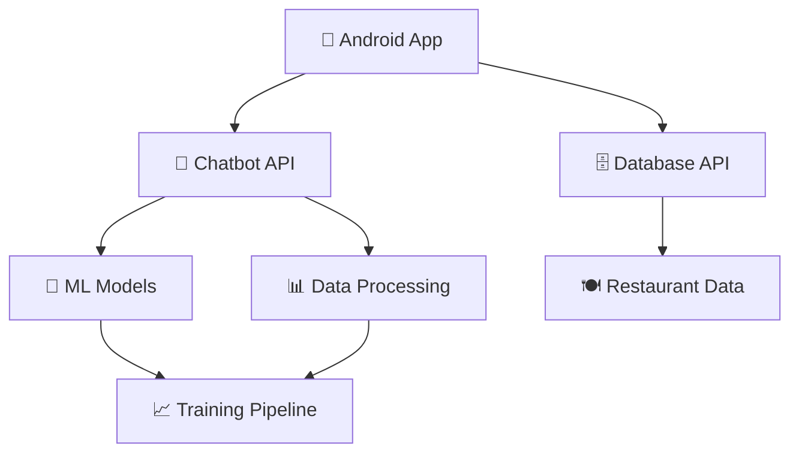

<div align="center">

# 🍽️ Restaurant Booking Recommender System
## 智能餐廳訂位推薦系統

[](https://python.org)
[](https://developer.android.com)
[](https://flask.palletsprojects.com)
[](https://docker.com)
[](LICENSE)

一個整合聊天機器人、數據收集、機器學習訓練、Android前端App的全流程智能餐廳推薦與訂位系統。

[🚀 快速開始](#-快速開始) • [📖 文檔](#-文檔) • [🏗️ 架構](#️-系統架構) • [🤝 貢獻](#-貢獻)

</div>


https://github.com/user-attachments/assets/5dd310de-5e97-4a9a-9221-af09ab4037ba


---

## ✨ 專案特色

<table>
<tr>
<td width="50%">

### 🤖 智能聊天機器人
- 基於深度學習的多輪對話系統
- 支援餐廳推薦、訂位、評論查詢
- 自然語言理解與生成

### 🧠 機器學習模型
- 多標籤分類模型
- 二分類模型
- LLaMA-3微調模型

</td>
<td width="50%">

### 📊 數據處理管道
- 完整的數據清洗流程
- 格式轉換與標準化
- 訓練數據自動生成

### 📱 Android前端App
- 用戶友善的推薦介面
- 訂位與地圖功能
- 即時聊天整合

</td>
</tr>
</table>

---

## 🚀 快速開始

> ⚠️ **重要提醒**: 開始前請先解壓縮資料檔案，否則後續資料處理與模型訓練將無法順利進行

### 📋 前置準備

<details>
<summary><b>📦 1. 解壓縮資料檔案</b></summary>

```bash
# 進入 Data 資料夾
cd Data

# 安裝解壓縮工具（Ubuntu/Debian）
sudo apt-get update
sudo apt-get install p7zip-full p7zip-rar

# 解壓縮所有資料檔案
7za x data.7z
7za x storeinfo_review.7z
7za x tag_embeddings.7z
7za x updated_storeinfo_tablesm.7z
```

</details>

<details>
<summary><b>🤖 2. 下載模型權重</b></summary>

下載模型權重並放置到 `model` 資料夾中：

🔗 [Google Drive 模型權重下載](https://drive.google.com/drive/folders/1xt2j6hwjhCDhpAqlXl1bVf1dRDx-EIxc?usp=sharing)

</details>

<details>
<summary><b>🔑 3. API 金鑰設定</b></summary>

編輯 `CHATBOT/env_api_key.env` 檔案：

```env
# Bland AI API Key (用於電話訂位功能)
BLAND_AI_API_KEY=your_bland_ai_api_key_here
```

</details>

### 🛠️ 環境安裝

選擇適合您的安裝方式：

<details>
<summary><b>📦 方法一：pip 安裝（推薦新手）</b></summary>

```bash
cd CHATBOT
pip install -r requirements.txt
```

</details>

<details>
<summary><b>🐍 方法二：Conda 環境（推薦開發者）</b></summary>

```bash
cd CHATBOT
conda env create -f environment.yml
conda activate chatbot
```

</details>

<details>
<summary><b>🐳 方法三：Docker 容器（推薦生產環境）</b></summary>

```bash
cd CHATBOT

# 建構 Docker 映像
docker build -t t-chatbot .

# 運行容器（支援 GPU）
docker run --gpus all -it \
  --name chatbot_env \
  -v /path/to/data:/app/data \
  -v /path/to/model:/app/model \
  -p 5000:5000 \
  t-chatbot /bin/bash

# 安裝編輯器
apt-get update && apt-get install nano -y

# 激活環境
conda activate chatbot
```

</details>

### ⚡ 一鍵啟動

#### 🤖 聊天機器人服務

```bash
cd CHATBOT

# 一鍵安裝與啟動（推薦）
python script.py setup    # 檢查/安裝依賴、下載模型、檢查資料
python script.py start    # 啟動伺服器

# 或手動啟動
python main.py
```

#### 🗄️ 資料庫服務

```bash
cd DB

# 一鍵啟動所有服務
docker compose down -v                    # 停止並清理舊容器
docker compose build --no-cache          # 重新建構所有服務
docker compose up -d                     # 啟動所有服務
```

#### 📱 Android 應用程式

使用 Android Studio 開啟 `App` 資料夾即可開始開發

### 🎯 常用指令

```bash
# 聊天機器人相關
python script.py test                    # 快速測試
python script.py status                  # 查看狀態
python script.py help                    # 參數說明
python script.py config-ip --ip YOUR_SERVER_IP  # 配置 IP
python script.py restore-template        # 還原模板
```

## 🏗️ 系統架構



## 📁 專案結構

```
restaurant-booking-recommender/
├── 🤖 CHATBOT/              # 聊天機器人後端
│   ├── main.py              # 主程式入口
│   ├── script.py            # 一鍵啟動腳本
│   ├── requirements.txt     # Python 依賴
│   └── model/               # 模型權重檔案
├── 📱 App/                  # Android 前端應用
│   ├── app/src/main/        # 主要原始碼
│   └── build.gradle.kts    # 建構配置
├── 📊 Data/                 # 資料處理與轉換
│   ├── data_raw/           # 原始資料
│   ├── data_processed/     # 處理後資料
│   └── scripts/            # 資料處理腳本
├── 🧠 Train/               # 機器學習模型訓練
│   ├── NLU_BERT_MULTILABEL.ipynb
│   ├── NLU_FOR_Binary.ipynb
│   └── Finetune_Llama3_with_LLaMA_Factory_ipynb
└── 🗄️ DB/                  # 資料庫與 API
    ├── api/                # PHP API 端點
    ├── flask/              # Flask 後端
    └── docker-compose.yml  # 容器編排
```

## 📖 文檔

### 🤖 聊天機器人後端

<details>
<summary><b>詳細使用說明</b></summary>

**主要功能**：
- 自然語言理解與生成
- 餐廳推薦與訂位
- 多輪對話管理

**快速啟動**：
```bash
cd CHATBOT
python script.py setup && python script.py start
```

**詳細文檔**：請參考 [`CHATBOT/README.md`](CHATBOT/README.md)

</details>

### 📱 Android 前端

<details>
<summary><b>詳細使用說明</b></summary>

**主要功能**：
- 用戶介面與互動
- 餐廳推薦展示
- 地圖整合與訂位

**開發環境**：
```bash
cd App
# 使用 Android Studio 開啟專案
```

**詳細文檔**：請參考 [`App/README.md`](App/README.md)

</details>

### 📊 資料處理

<details>
<summary><b>詳細使用說明</b></summary>

**主要功能**：
- 資料清洗與標準化
- 格式轉換與翻譯
- 訓練資料生成

**使用方式**：
```bash
cd Data/scripts
python change_to_json.py
python change_format.py
# 更多腳本請參考 Data/README.md
```

**詳細文檔**：請參考 [`Data/README.md`](Data/README.md)

</details>

### 🧠 模型訓練

<details>
<summary><b>詳細使用說明</b></summary>

**可用模型**：
- **多標籤分類**：`NLU_BERT_MULTILABEL.ipynb`
- **二分類模型**：`NLU_FOR_Binary.ipynb`
- **LLaMA-3 微調**：`Finetune_Llama3_with_LLaMA_Factory_ipynb`

**環境準備**：
```bash
pip install transformers datasets accelerate torch
```

**詳細文檔**：請參考 [`Train/README.md`](Train/README.md)

</details>

## ⚠️ 注意事項

<table>
<tr>
<td width="50%">

### 🔐 安全性
- 敏感金鑰請勿上傳至公開倉庫
- 使用環境變數管理 API 金鑰
- 定期更新依賴套件

### 📦 資料管理
- 大型模型與資料檔案請依說明下載
- 確保資料檔案放置正確路徑
- 執行訓練前請備份重要資料

</td>
<td width="50%">

### 🛠️ 開發建議
- 請依各子資料夾 README 進行詳細操作
- 建議使用虛擬環境隔離依賴
- 定期檢查系統資源使用情況

### 📚 學習資源
- 詳細文檔請參考各子資料夾內的 `README.md`
- 建議先熟悉基礎概念再進行進階操作

</td>
</tr>
</table>

## 🤝 貢獻

歡迎貢獻代碼、報告問題或提出建議！

### 貢獻方式
1. Fork 本專案
2. 創建功能分支 (`git checkout -b feature/AmazingFeature`)
3. 提交更改 (`git commit -m 'Add some AmazingFeature'`)
4. 推送到分支 (`git push origin feature/AmazingFeature`)
5. 開啟 Pull Request

### 問題回報
如果您遇到問題，請：
1. 檢查 [Issues](../../issues) 是否已有類似問題
2. 提供詳細的錯誤訊息和環境資訊
3. 附上相關的日誌檔案

## 📄 授權

本專案採用 MIT 授權條款 - 詳見 [LICENSE](LICENSE) 檔案

---

<div align="center">

**⭐ 如果這個專案對您有幫助，請給我們一個 Star！**

Made with ❤️ by the Restaurant Booking Team

</div>
